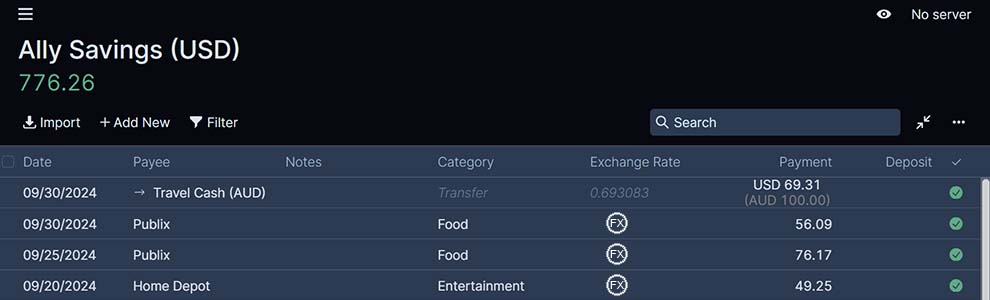

# Actual Budget Multi-Currency Discussion
Notes and Discussion points for adding Multi-Currency to Actual Budget

[Discord - #Ideas - Support for Multi Currency Budget](https://discord.com/channels/937901803608096828/1224674202083393597)

## User Interface

> [!NOTE]  
> The images below are ideas and not the final layout/design.

### Creating a New Budget
Currently, when creating a new budget, no questions are asked.  A new budget file is created and it is up to the user to find and change settings or rename the budget file.  Since it would be better to set the currency before the budget file is created I would suggest a "New Budget" popup be created similar to the "Add Account" popup.  This "New Budget" popup would have the ability to set the budget name, base currency, and a few setting such as formatting.

### Creating New Account
Add "Currency" dropdown to Create Account dialog.  The currency should default to the base budget currency.  Once created, the account currency will not be able to be changed.


### Settings Page
Add Currency selection to the Formatting section of the settings page.


If transitioning a previous budget, currency will be shown "default", "unknown", "not set", or something similar.


Once a currency is selected, the currency type should display, but should NOT be able to be changed.

> [!NOTE]  
> In the future, it may be possible to change the budget currency from the settings page and have each account keep it's own account currency.  This would allow for keeping the same budget file while being able to budget in different currencies at different times.

### Account Page (base budget accounts)
Base budget currency code should be displayed in the account header.  The only other change would be to individual transactions.



#### Transactions
Add column for either "Exchange Rate" or "FX".<br/>
If there is an exchange rate then the rate would be listed along with the two amounts.  The two amounts should show the currencies.  And the FX amount would need a currency selection box unless it is a transfer.<br/>
If there is no exchange rate then an icon can be displayed to be able to convert the transaction to a FX transaction.  This would be usefull for the one-off transactions (buying food in Australia with a US credit/debit card).  Both of the currencies could be listed:  FX currency from POS and account currency from the credit/debit card statement.

For useage, see [Account Page (non base budget account) - Transactions](#transactions-1)

### Account Page (non base budget accounts)
The account currency should be displayed in the account header.  The account value should be in the account currency with an option to display the base currency.


#### Transactions
Adding a transaction will default to the exchange rate set to the last know exchange rate for that account.  The user can adjust the exchange rate.  If the user does change the exchange rate a popup should be displayed asking if this exchange rate should be added to the exchange rate table.

The user would then enter the transaction amount in the account currency and the base currency would auto calculate from the exchange rate.  If the base currency amount is changed then the exchange rate would be calculated from the account currency and the base currency.<br/>
Account currency should never be auto calculated.

### Sidebar
Add new button titled 'FX Rates' in the More section with Payees and Rules.<br/>
Account Groups (For budget and Off Budget) will keep the same base currency total (which will be calculated from the current FX rate applied to the current FX account balance).  However, an account in a different currency will need to display either:
1) List the currency code next to the name with the base currency code next to the amount.  The base currency amount will be calculated from the current FX balance then converted to base budget currency with the latest exchange rate found in the FX Rate table.<br/>
   ```Regular Cash (EUR)     USD 102.34```
2) List the currency code next to the current FX balance.<br/>
   ```Regular Cash            EUR 92.40```
> [!NOTE]  
> A settings option could be used to display the currency symbol too.  
> ```Regular Cash (EUR)         92.40 €```  
> as shown in https://github.com/actualbudget/actual/issues/1132#issuecomment-2290824901

### FX Rate Page (new page)
The FX Rate Page should list the FX rates by date and be able to sort/filter by date, currency, account, or rate.  This will be a new page and be in the same group as Payees and Rules.

|    Date    | Currency |   Account    |   Rate    | Multiplier |
| ---------- | -------- | ------------ | --------- | ---------- |
| 10/01/2024 |   EUR    | Regular Cash |  1.1076   |     1      |
| 09/30/2024 |   AUD    | Travel Cash  |  0.693083 |     1      |
| 09/15/2025 |   EUR    | Regular Cash |  1.1012   |     1      |
| 09/10/2024 |   AUD    | Travel Cash  |  0.674169 |     1      |

> [!NOTE]  
> The multiplier field may not be necessary, but [rmillian/multi-currency](https://ynab.rmillan.com/plugins/multi-currency) uses the multiplier field and some currencies have a high exchange rate. (1 Euro = 4,030.86 Ugandan Shilling)

<br/><br/>
## Next Steps
### Step 1 - Add Currency Support

Actual Budget currently does not use any specific currency.  Currently, all transaction amounts are stored in the SQLite database as an Integer using a minor unit of 2.  This means that before the amount is stored it is multiplied by 100 ($123.45 is stored as 12345).  This works for 255 of the 264 currencies listed in ISO 4217, but does not work for all currencies. <br/>
#### Currency Minor Units (from ISO 4217)
0 minor units - 31 currencies <br/>
2 minor units - 224 currencies </br>
3 minor units - 7 currencies (Bahraini Dinar, Iraqi Dinar, Jordanian Dinar, Kuwaiti Dinar, Libyan Dinar, Rial Omani, Tunisian Dinar) <br/>
4 minor units - 2 currencies (Unidad de Fomento, Unidad Previsional)

ISO 4217 can be downloaded as an XML file from :<br/>
https://www.iso.org/iso-4217-currency-codes.html <br/>
[list-one.xml](list-one.xml) was downloaded from iso.org.<br/>
The XML file is organized by country name.  AB will need to turn this XML file organized by country name to a JS Object organized by currency code (UNITED STATES OF AMERICA (THE) -> USD or AUSTRIA -> EUR).<br/>
[Example JSON/JS Object](iso4217_currencies.json)<br/>
ISO 4217 does not include currency symbols.  Current list of symbols can be found at:
- https://www.xe.com/symbols/
- https://en.wikipedia.org/wiki/Currency_symbol#List_of_currency_symbols_currently_in_use

[currency_symbols.json](currency_symbols.json) was extracted from xe.com/symbols

Structure for Currency Information Object:
```
{
  code: {                         // "AFN"
    "name": string,               // "Afghani"
    "number": number,             // 971
    "minorUnits": number,         // 2
    "symbol": string,             // "؋"
    "country": Array(string),     // [ "AFGHANISTAN" ]
  },
}
```
[Example: (iso4217_currencies.json)](iso4217_currencies.json)
```
"INR": {
  "name": "Indian Rupee",
  "number": 356,
  "minorUnits": 2,
  "symbol": "₹",
  "countries": [
    "BHUTAN",
    "INDIA"
  ],
},
```

#### Step 1 - Todo
1) Create Currency class that stores:<br/>
   a list of currencies as defined above;<br/>
   lookup functions such as:
   ```
   getCurrency(currencyCode): Currency
   Currency.getMinorUnit(): number
   Currency.getSymbol(): string
   ```
2) Read iso4217.json into Currency class 
3) Add {```currency: string```} field to AB global settings as the base budget currency.  Add currency selection to Settings page for a one-time setting of currency.
> [!WARNING]
> Changing a base currency would require a conversion to the new currency and is beyond the current scope of the project. This may be a future feature, but not initial.  Once the base currency is set, the settings should be grayed out and only display the base currency.
5) Convert AB's current fixed minor units to minor unit based on selected currency.
6) Possibly add option to view currency symbols.

[Discord Discussion](https://discord.com/channels/937901803608096828/1224674202083393597/1290451173433675889)

### Step 2 - FX rate Table
For now, the FX rate table will be manual entry only.  In the future automatic lookup can be figured out, but stay simple for the beginning.  Transfer transactions can trigger an automatic entry into the FX rate table, but regular purchase will not.
#### Step 2 - Todo
1) Create new table in SQLite that would include the following fields:
   ```
   date:              // same date format currently use in other tables
   code: text         // EUR, USD, AUD, etc
   account:           // same account format currently use in other tables
   rate: integer      // stored as an integer with 6 significant figures
   ```
2) Create FX rate CRUD functions
